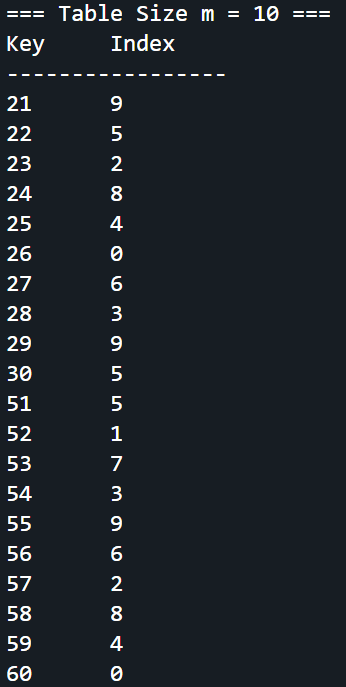
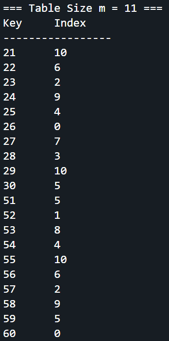
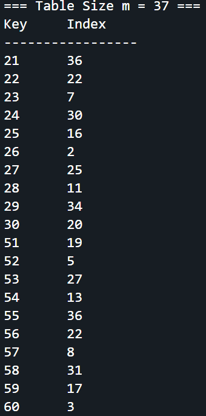
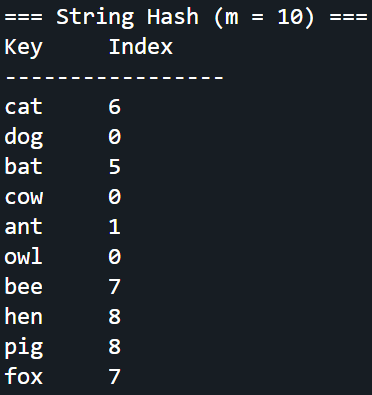
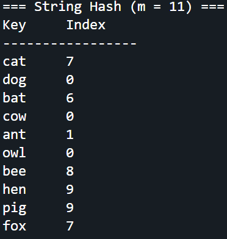
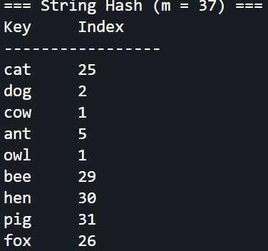

# Homework Assignment IV: Hash Function Design & Observation (C/C++ Version)

This assignment focuses on the design and observation of hash functions using C/C++. 
Students are expected to implement and analyze the behavior of hash functions, 
evaluate their efficiency, and understand their applications in computer science.

Developer:  Kuan-Ti Chiang (Bradon)   
Email:
-   s1123306@mail.yzu.edu.tw 
-   contact@bradon.cc  

## My Hash Function
### Integer Keys 
- Formula / pseudocode:
  ```text
  Function myHashInt(key, m):
    A = 0.6180339887498948482
    v = key * A
    fractional = v - integer part of v
    return parseInt(m * fractional)
  End Function
  ```
- Rationale: 
  - Multiply key with Knuth’s number to spread values.
  - Take fractional part to keep index in [0, m-1].
  - Helps reduce collisions and makes indices more uniform.

### Non-integer Keys
- Formula / pseudocode:
  ```text
  Function myHashString(key, m):
    hash = 0  // Initialize hash value
    For each character c in str
        hash = hash XOR ((hash << 5) + (hash >> 2) + ASCII(c) + 1315423911)
    End For
    A = 0.6180339887498948482
    v = key * A
    fractional = v - integer part of v
    return parseInt(m * fractional)
  End Function
  ```
- Rationale: 
  - Convert string to number using bit operations (based on PJW hash).
  - Shift, XOR, and add – this mixes all bits of the string to make hash values more random and spread out.
  - Multiply key with Knuth’s number to spread values.

## Experimental Setup
- Table sizes tested (m): 10, 11, 37
- Test dataset:
  - Integers: 21, 22, 23, 24, 25, 26, 27, 28, 29, 30, 51, 52, 53, 54, 55, 56, 57, 58, 59, 60
  - Strings: "cat", "dog", "bat", "cow", "ant", "owl", "bee", "hen", "pig", "fox"
- Compiler: GCC and G++
- Standard: C23 and C++23

## Results
### Integer Keys
| Table Size (m) | Index Sequence         | Observation              |
|----------------|------------------------|--------------------------|
| 10             | 9, 5, 2, 8, 4, 0, 6, 3, 9, 5, 5, 1, 7, 3, 9, 6, 2, 8, 4, 0        |Small table (non-prime), numbers repeat and many collisions happen.|
| 11             | 10, 6, 2, 9, 4, 0, 7, 3, 10, 5, 5, 1, 8, 4, 10, 6, 2, 9, 5, 0       | Prime table, distribution is better, fewer collisions.remain.             |
| 37             | 36, 22, 7, 30, 16, 2, 25, 11, 34, 20, 19, 5, 27, 13, 36, 22, 8, 31, 17, 3    | Large prime table, numbers are spread evenly, almost no collisions.             |
### Non-Integer Keys
| Table Size (m) | Index Sequence         | Observation              |
|----------------|------------------------|--------------------------|
| 10             | 6, 0, 5, 0, 1, 0, 7, 8, 8, 7        |Small table, many strings map to same index → collisions.|
| 11             | 7, 0, 6, 0, 1, 0, 8, 9, 9, 7       | Prime table reduces collisions slightly.             |
| 37 | 25, 2, 20, 1, 5, 1, 29, 30, 31, 26    | Large prime table spreads values well → fewer collisions.|
## Compilation, Build, Execution, and Output

### Compilation
- The project uses a comprehensive Makefile that builds both C and C++ versions with proper flags:
  ```bash
  # Build both C and C++ versions
  make all
  
  # Build only C version
  make c
  
  # Build only C++ version
  make cxx
  ```

### Manual Compilation (if needed)
- Command for C:
  ```bash
  gcc -std=c23 -Wall -Wextra -Wpedantic -g -o C/hash_function C/main.c C/hash_fn.c
  ```
- Command for C++:
  ```bash
  g++ -std=c++23 -Wall -Wextra -Wpedantic -g -o CXX/hash_function_cpp CXX/main.cpp CXX/hash_fn.cpp
  ```

### Clean Build Files
- Remove all compiled files:
  ```bash
  make clean
  ```

### Execution
- Run the compiled binary:
  ```bash
  ./hash_function
  ```
  or
  ```bash
  ./hash_function_cpp
  ```

### Result Snapshot
- Output for integers:
  - m = 10
     
  - m = 11
    
  - m = 37
    
- Output for strings:
  - m = 10
     
  - m = 11
    
  - m = 37
    
  
- Observations: Outputs align with the analysis, showing better distribution with prime table sizes.

## Analysis
- Prime table sizes give better spread and fewer collisions.
- Non-prime table sizes repeat patterns and have more collisions.
- Multiplicative hashing spreads keys better than squared hashing.
- Bigger table sizes reduce collisions.

## Reflection
1. A good hash function should be simple and spread keys evenly.simplicity and effectiveness to minimize collisions.
2. Prime table sizes work better than non-prime sizes.
3. Multiplicative hashing with Knuth’s number gives the most uniform results.

## Reference
1. [Introduction to Algorithms, 2nd Edition, Thomas H. Cormen, Charles E. Leiserson, Ronald L. Rivest, Clifford Stein. MIT Press / McGraw‑Hill, 2001.](https://mcube.lab.nycu.edu.tw/~cfung/docs/books/cormen2001algorithms.pdf)
2. [PJW_hash_function “PJW hash function”, Wikipedia.](https://en.wikipedia.org/wiki/PJW_hash_function)
3. [HMC CS070 Homework – Hash Functions (Hash functions overview and examples) — Harvey Mudd College CS070 class materials.](https://www.cs.hmc.edu/~geoff/classes/hmc.cs070.200101/homework10/hashfuncs.html)
